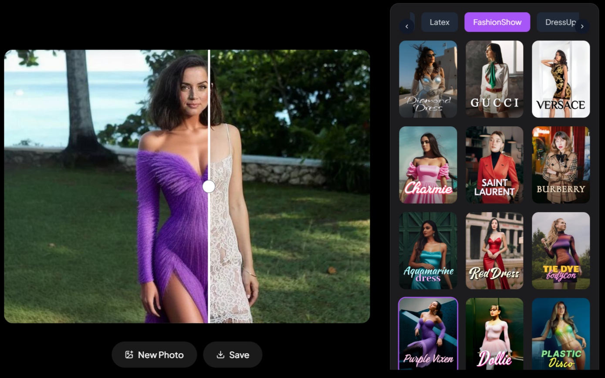

# AzmLook

A React-based web application for AI-powered photo transformations.


## Features

- Drag & drop or click to upload photos
- Real-time image transformation with AI filters
- Interactive before/after comparison slider
- Filter categories and grid view
- Mobile responsive design
- Download processed images

## Tech Stack

- React 18
- TypeScript
- TailwindCSS
- Vite
- Lucide Icons

## Development

```bash
# Install dependencies
npm install

# Start dev server
npm run dev

# Build for production
npm run build
```
